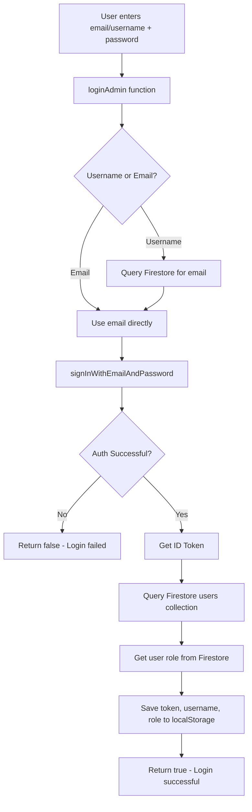

# BICC Admin Portal - RBAC System Documentation

**Last Updated:** June 10, 2026  
**Status:** ✅ Fully Implemented  
**Location:** `apps/admin-portal/src/api.ts`

---

## Overview

The BICC Admin Portal uses a **Role-Based Access Control (RBAC)** system to manage permissions for different user types. The system controls:

- **Tab Access** - Which admin tabs users can see
- **Edit Permissions** - Who can create/modify content
- **Delete Permissions** - Who can remove records
- **User Management** - Who can create/manage admin users

---

## User Roles

### 1. Super Admin (Full Control)
**Access Level:** Highest  
**Who Gets This:** IT Administrator, System Owner

**Permissions:**
- ✅ Access to ALL 16 admin tabs
- ✅ Can create, edit, delete all content
- ✅ Can manage users (create, edit, delete admin accounts)
- ✅ Can access User Management tab
- ✅ Can assign roles to other users

**Tabs Available:**
```
Dashboard, Events, News, Contacts, Bookings, Gallery, Venues, Users,
Testimonials, Partners, Downloads, Careers, Tenders, Subscribers,
Pricing, Quotations, Booking Workflow, Customers
```

---

### 2. Manager (Content Management)
**Access Level:** High  
**Who Gets This:** Operations Manager, Events Manager

**Permissions:**
- ✅ Access to most admin tabs (all except Users)
- ✅ Can create, edit, delete content
- ✅ Can manage bookings and respond to inquiries
- ❌ Cannot manage users or assign roles

**Tabs Available:**
```
Dashboard, Events, News, Contacts, Bookings, Gallery, Venues,
Testimonials, Partners, Downloads, Careers, Tenders, Subscribers,
Pricing, Quotations, Booking Workflow, Customers
```

---

### 3. Staff (Limited Access)
**Access Level:** Basic  
**Who Gets This:** Front desk, Event coordinators, Support staff

**Permissions:**
- ✅ Access to essential tabs only
- ✅ Can view and edit basic content
- ✅ Can manage bookings and respond to inquiries
- ❌ Cannot delete most content
- ❌ Cannot manage venues, users, or pricing

**Tabs Available:**
```
Dashboard, Events, News, Contacts, Bookings, Gallery,
Downloads, Careers
```

---

## Permission Functions

### Core Permission Checks

```typescript
// Get current logged-in user's role
getCurrentUserRole(): string
// Returns: 'Super Admin', 'Manager', or 'Staff'

// Check if current user is Super Admin
isSuperAdmin(): boolean
// Returns: true or false

// Check if user has specific permission
hasPermission(action: string): boolean
// Actions: 'events', 'news', 'contacts', 'gallery', 'venues', 'users', 'delete', 'edit'

// Check if user can access a specific tab
canAccessTab(tab: string): boolean
// Tabs: 'dashboard', 'events', 'news', 'contacts', 'bookings', etc.

// Check if user can edit content
canEdit(): boolean
// Returns: true or false

// Check if user can delete content
canDelete(): boolean
// Returns: true or false
```

---

## How Roles Are Stored

### 1. Firebase Authentication
- User email and password stored securely in Firebase Auth
- Password **never stored** in Firestore

### 2. Firestore Collection: `users`
```typescript
{
  id: "doc_id",
  email: "admin@bicc.gm",
  username: "admin_user",
  role: "Super Admin",  // or "Manager" or "Staff"
  created_at: "2026-06-10T10:00:00.000Z"
}
```

### 3. localStorage (Client-Side Session)
```typescript
localStorage.setItem('bicc_token', token);
localStorage.setItem('bicc_username', email);
localStorage.setItem('bicc_user_role', role);  // Role cached for quick access
```

---

## Login Flow with RBAC



**Code Flow:**
1. User submits login form
2. `loginAdmin()` checks if input is username or email
3. If username, lookup email in Firestore
4. Authenticate with Firebase Auth
5. Fetch user role from Firestore `users` collection
6. Store role in `localStorage` for quick permission checks
7. User is logged in with proper role

---

## Tab Access Control

### How It Works

In `Admin.tsx`, tabs are filtered based on role:

```typescript
const allTabs = [
  { key: 'dashboard', label: 'Dashboard', icon: LayoutDashboard },
  { key: 'events', label: 'Events', icon: Calendar },
  { key: 'users', label: 'Users', icon: Users },
  // ... all 16 tabs
];

// Only show tabs the current user has access to
const tabs = allTabs.filter(tab => api.canAccessTab(tab.key));
```

### Tab Access Matrix

| Tab | Super Admin | Manager | Staff |
|-----|------------|---------|-------|
| Dashboard | ✅ | ✅ | ✅ |
| Events | ✅ | ✅ | ✅ |
| News | ✅ | ✅ | ✅ |
| Contacts | ✅ | ✅ | ✅ |
| Bookings | ✅ | ✅ | ✅ |
| Gallery | ✅ | ✅ | ✅ (view only) |
| Venues | ✅ | ✅ | ❌ |
| Users | ✅ | ❌ | ❌ |
| Testimonials | ✅ | ✅ | ❌ |
| Partners | ✅ | ✅ | ❌ |
| Downloads | ✅ | ✅ | ✅ |
| Careers | ✅ | ✅ | ✅ |
| Tenders | ✅ | ✅ | ❌ |
| Subscribers | ✅ | ✅ | ❌ |
| Pricing | ✅ | ✅ | ❌ |
| Quotations | ✅ | ✅ | ❌ |
| Booking Workflow | ✅ | ✅ | ❌ |
| Customers | ✅ | ✅ | ❌ |

---

## Edit/Delete Permissions

### UI Button Rendering

Edit and delete buttons are conditionally rendered:

```typescript
// Example from EventsTab component
{api.canEdit() && (
  <button onClick={() => handleEdit(event)}>
    <Edit size={16} />
  </button>
)}

{api.canDelete() && (
  <button onClick={() => handleDelete(event.id)}>
    <Trash2 size={16} />
  </button>
)}
```

### Permission Matrix

| Role | Can Edit | Can Delete |
|------|----------|------------|
| Super Admin | ✅ Yes | ✅ Yes |
| Manager | ✅ Yes | ✅ Yes |
| Staff | ✅ Yes | ❌ No |

**Note:** Staff can edit content but cannot delete anything except their own bookings/contacts.

---

## User Management (Super Admin Only)

### Creating New Admin Users

**Access:** Super Admin ONLY

**Function:** `createUser()`

```typescript
export async function createUser(data: {
  email: string;
  username: string;
  password: string;
  role?: string;
}): Promise<any> {
  // 1. Create account in Firebase Auth
  await createUserWithEmailAndPassword(auth, data.email, data.password);

  // 2. Save metadata to Firestore (NO password stored here)
  const userData = {
    email: data.email,
    username: data.username,
    role: data.role || 'Staff',  // Default to Staff if not specified
    created_at: new Date().toISOString(),
  };

  const docRef = await addDoc(collection(db, 'users'), userData);
  return { id: docRef.id, ...userData };
}
```

**Security:**
- ✅ Password stored ONLY in Firebase Auth (encrypted)
- ✅ Firestore stores only safe metadata
- ✅ Only Super Admin can access Users tab

---

## Permission Definitions

### Full Permission Map

Located in `api.ts`:

```typescript
const permissions: Record<string, string[]> = {
  'Super Admin': [
    'events', 'news', 'contacts', 'gallery', 'venues', 'users',
    'delete', 'edit'
  ],
  'Manager': [
    'events', 'news', 'contacts', 'gallery', 'venues',
    'delete', 'edit'
  ],
  'Staff': [
    'events', 'news', 'contacts', 'view_gallery', 'view_venues',
    'gallery', 'edit'
  ],
};
```

### Tab Access Map

Located in `api.ts`:

```typescript
const tabAccess: Record<string, string[]> = {
  'Super Admin': [
    'dashboard', 'events', 'news', 'contacts', 'bookings', 'gallery', 'venues',
    'users', 'testimonials', 'partners', 'downloads', 'careers', 'tenders',
    'subscribers', 'pricing', 'quotations', 'booking_workflow', 'customers',
  ],
  'Manager': [
    'dashboard', 'events', 'news', 'contacts', 'bookings', 'gallery', 'venues',
    'testimonials', 'partners', 'downloads', 'careers', 'tenders', 'subscribers',
    'pricing', 'quotations', 'booking_workflow', 'customers',
  ],
  'Staff': [
    'dashboard', 'events', 'news', 'contacts', 'bookings', 'gallery',
    'downloads', 'careers',
  ],
};
```

---

## Security Implementation

### 1. Client-Side (UI Level)
- ✅ Tabs hidden based on role
- ✅ Buttons hidden based on permissions
- ✅ Forms disabled for unauthorized actions

### 2. Backend (Firebase Rules)
**Firestore Rules:** Located in `firebase/firestore.rules`

```javascript
// Example: Only authenticated users can write to admin collections
match /users/{userId} {
  allow read: if request.auth != null;
  allow write: if request.auth != null && 
               get(/databases/$(database)/documents/users/$(request.auth.uid)).data.role == 'Super Admin';
}
```

**Note:** Client-side checks are for UX only. Firebase rules provide **actual security**.

---

## How to Change Permissions

### Option 1: Add New Role

**File:** `apps/admin-portal/src/api.ts`

1. Add role to `permissions` object:
```typescript
const permissions: Record<string, string[]> = {
  'Super Admin': [...],
  'Manager': [...],
  'Staff': [...],
  'Finance Officer': ['pricing', 'quotations', 'edit', 'view_venues'],  // New role
};
```

2. Add role to `tabAccess` object:
```typescript
const tabAccess: Record<string, string[]> = {
  // ... existing roles
  'Finance Officer': ['dashboard', 'pricing', 'quotations', 'bookings'],
};
```

3. Update Firestore rules if needed
4. Create users with the new role in Users tab

---

### Option 2: Modify Existing Role Permissions

**File:** `apps/admin-portal/src/api.ts`

Example: Give Staff access to Tenders tab:

```typescript
const tabAccess: Record<string, string[]> = {
  'Staff': [
    'dashboard', 'events', 'news', 'contacts', 'bookings', 'gallery',
    'downloads', 'careers', 'tenders',  // Add this
  ],
};
```

---

## Common RBAC Tasks

### 1. Check User's Current Role
```typescript
import { getCurrentUserRole } from '../api';

const userRole = getCurrentUserRole();
console.log(`Current user role: ${userRole}`);
```

### 2. Show/Hide UI Based on Permission
```typescript
import { canEdit, isSuperAdmin } from '../api';

// Show edit button only if user can edit
{canEdit() && (
  <button onClick={handleEdit}>Edit</button>
)}

// Show admin-only feature
{isSuperAdmin() && (
  <div>Super Admin Only Content</div>
)}
```

### 3. Prevent Action If No Permission
```typescript
import { hasPermission } from '../api';

const handleDelete = () => {
  if (!hasPermission('delete')) {
    alert('You do not have permission to delete');
    return;
  }
  
  // Proceed with delete
  deleteItem();
};
```

---

## Testing RBAC

### Test User Accounts

Create test accounts for each role:

| Email | Password | Role | Username |
|-------|----------|------|----------|
| superadmin@bicc.gm | TestPass123 | Super Admin | superadmin |
| manager@bicc.gm | TestPass123 | Manager | manager |
| staff@bicc.gm | TestPass123 | Staff | staff |

### Test Checklist

**Super Admin Tests:**
- [ ] Can see all 16+ tabs
- [ ] Can create/edit/delete all content
- [ ] Can access Users tab
- [ ] Can create new admin users
- [ ] Can assign roles

**Manager Tests:**
- [ ] Can see 15+ tabs (all except Users)
- [ ] Can create/edit/delete content
- [ ] Cannot access Users tab
- [ ] Cannot create admin users

**Staff Tests:**
- [ ] Can see only 8 tabs
- [ ] Can edit content
- [ ] Cannot delete content
- [ ] Cannot access advanced tabs (Pricing, Tenders, etc.)
- [ ] Cannot access Users tab

---

## Future RBAC Enhancements

### Phase 4 Features (Planned)

#### 1. Granular Permissions
Instead of role-based, add permission-based:
```typescript
{
  user: "john@bicc.gm",
  permissions: ["events:read", "events:write", "bookings:read", "users:create"]
}
```

#### 2. Department-Based Roles
```typescript
'Events Officer' - Only events and bookings
'Finance Officer' - Only pricing, quotations, reports
'HR Officer' - Only careers and applications
'IT Administrator' - Full system access
```

#### 3. Field-Level Permissions
Control which fields users can edit:
```typescript
{
  role: 'Staff',
  canEditFields: ['title', 'description'],
  cannotEditFields: ['price', 'status', 'published']
}
```

#### 4. Audit Logging
Track all permission changes:
```typescript
{
  timestamp: "2026-06-10T10:30:00Z",
  admin: "superadmin@bicc.gm",
  action: "role_changed",
  target: "staff@bicc.gm",
  from: "Staff",
  to: "Manager"
}
```

#### 5. Permission Management UI
Visual interface to assign permissions without editing code:
- Drag-and-drop permission builder
- Role templates
- Permission inheritance
- Custom role creator

---

## Troubleshooting

### Problem: User can't see expected tabs
**Cause:** Role not set correctly in Firestore  
**Fix:**
1. Open Firestore Console
2. Go to `users` collection
3. Find user document
4. Check `role` field matches exactly: `Super Admin`, `Manager`, or `Staff`
5. Re-login to refresh localStorage

### Problem: Permission denied errors
**Cause:** Firebase rules blocking access  
**Fix:**
1. Check `firebase/firestore.rules`
2. Ensure authenticated users have read/write access
3. Redeploy rules: `firebase deploy --only firestore:rules`

### Problem: Role not persisting after login
**Cause:** localStorage not saving role  
**Fix:**
1. Check browser console for errors
2. Clear localStorage: `localStorage.clear()`
3. Re-login
4. Check: `localStorage.getItem('bicc_user_role')`

### Problem: Super Admin can't create users
**Cause:** User creation function failing  
**Fix:**
1. Check Firebase Auth is enabled
2. Check "Email/Password" provider is enabled in Firebase Console
3. Check Firestore rules allow write to `users` collection
4. Check browser console for specific error

---

## Security Best Practices

### ✅ DO:
- Always check permissions on both client AND server (Firestore rules)
- Store roles in Firestore, cache in localStorage
- Use exact role names: `'Super Admin'`, `'Manager'`, `'Staff'`
- Log permission changes for audit trail
- Validate user role on every sensitive operation
- Re-verify token on page load

### ❌ DON'T:
- Store passwords in Firestore (use Firebase Auth only)
- Trust client-side checks alone (implement Firestore rules)
- Hardcode roles in multiple places (use centralized functions)
- Allow users to modify their own role
- Expose Super Admin credentials
- Skip permission checks on API calls

---

## API Reference

### Authentication Functions
```typescript
loginAdmin(emailOrUsername: string, password: string): Promise<boolean>
verifyToken(): Promise<boolean>
logoutAdmin(): void
isAdminLoggedIn(): boolean
```

### Role Functions
```typescript
getCurrentUserRole(): string
isSuperAdmin(): boolean
hasPermission(action: string): boolean
canAccessTab(tab: string): boolean
canEdit(): boolean
canDelete(): boolean
```

### User Management Functions (Super Admin Only)
```typescript
fetchUsers(): Promise<any[]>
createUser(data: { email, username, password, role }): Promise<any>
updateUser(id: string, data: any): Promise<void>
deleteUser(id: string): Promise<void>
```

---

## Summary

✅ **RBAC is fully implemented** in BICC Admin Portal  
✅ **Three roles:** Super Admin, Manager, Staff  
✅ **Permission functions** control tab access, edit, delete  
✅ **Secure authentication** via Firebase Auth  
✅ **Role-based UI rendering** hides unauthorized features  
✅ **Extensible system** ready for Phase 4 enhancements

**Files:**
- `apps/admin-portal/src/api.ts` - All RBAC functions
- `apps/admin-portal/src/pages/Admin.tsx` - Tab filtering
- `firebase/firestore.rules` - Backend security rules

**Status:** Production-ready ✅

---

*Last Updated: June 10, 2026*  
*Document Version: 1.0*
